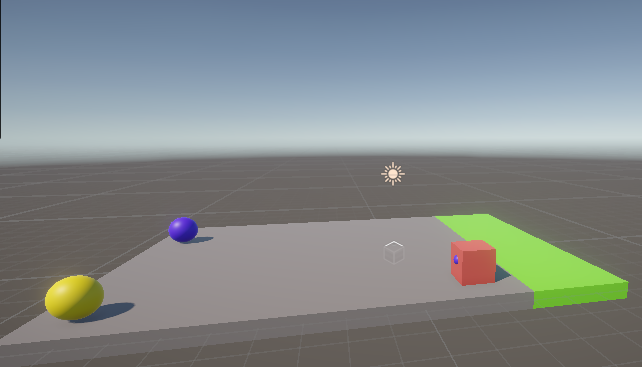

Deze readme gaat ervanuit dat de editor toegang heeft tot de repository met bijhorende scripts.
- Opstelling: Een sprongoefening waarbij de agent over bepaalde opstakels moet springen.
- Doel: Spring over de blauwe obstakels. Blijf op de grond voor gele.
- Agents: Er is 1 agent.
- Agent Reward Function:
	- -0.01 per sprong
	- +0.01 als de agent de optie "niets" doet.
	- -0.5 als de agent een blauw obstakel raakt.
	- +0.8 als de agent een blauw obstakel ontwijkt.
	- +1.0 als de agent een geel obstakel aanraakt.
	- -0.5 als de agent een geel obstakel ontwijkt.
	- +1.0 als de agent twee keer op een rij een blauw obstakel ontwijkt.
- Behavior Parameters:
	- Actions: 1 discrete action branch met 3 actions (spring of do niets).
	- Visuele Observaties: 1 ray sensor die een ray naar voren stuurt.

### Uitleg opstelling.

Er is 1 cube object nodig dat dient als platform. Optioneel kan deze nog worden uitgebreid met een finishzone ter verduidelijking.
Verder zijn er nog 2 sphere objecten nodig die dienen als obstakel. Beide hebben een RigidBody component nodig waarin de freeze positie zodanig is ingesteld dat ze enkel naar voor en naar achter kunnen bewegen.
Om de obstakels te onderscheiden is aangeraden ze een kleur te geven en worden ze in deze readme benoemd als "Target" en "Bonustarget".
Als laatste is er de agent als cube object. Deze agent heeft een RigidBody en de volgende componenten:
- Behavior Parameters
Als Behavior name wordt dezelfde naam gekozen als beschreven in de config..yaml in mijn geval jumper
Bij Vector opservation is de space size 3.
Bij actions is de Continious action 2 en de Discrete Branch 1.
Om een nieuw model te treinen laat je het veld model leeg.
- Ray Perception
1 ray per direction is voldoende. Ook de Max Ray Degrees kan ongewijzigd blijven gezien de agent recht naar het spawnpunt van de opstakels moet kijken.
De Ray length met ver genoeg reiken om de obstakels al vanaf spawn te kunnen zien
het script "LermytteAlainCubeAgent". Met als Target het target object en als Bonus Target het Bonustarget object.
Een Decision Requester met als Decision Period 5.

Zet de agent op kleine afstand van de rand van het platform. 
Roteer de platform of wijzig de coördinaten in het LermytteAlainCubeAgent zodat de Target naar de agent zal bewegen bij het starten van de training.
Plaats de Bonustarget op een zijkant van het platform. Wijzig diens de coördinaten in het script zodat deze op de zijkant start.
Voor beide objecten wijzig de coördinaten zodat ze naar de agent gaan als ze worden ingespawnd.
Als alles correct is ingesteld start het met de Target die naar de agent gaat. En indien de agent over het obstakel springt verschijnt er ofwel een 2e obstakel ofwel de Bonustarget die dan ook naar de agent gaat.

### Verslag training

Bij de trainingen is er veel geëxperimenteerd met de parameters van de beloningen en de hyperparameters beta en learning rate. Bij de beloningen is het de bedoeling om de agent aan te leren om 2 keer op een rij de juiste keuze te laten maken voordat de oefening opnieuw begint.
Hoewel het gedrag van de agent zich licht wijzigde was het gewenst resultaat dat de agent zeer vaak over de juiste opstakel springt niet bereikt. Bij mijn laatste paar testen heb ik de hyperparameters van de jumper.yaml file gebruikt gegeven door de lector.
Bij het trainen viel mij het meeste op dat hoe langer de training verliep hoe minder vaak de agent besluit om te springen. Naarmate dat de training vorderde is ook het patroon verschenen dat nadat de agent succesvol over een obstakel springt, hij vaak opnieuw een sprong wil maken.

Mijn conclusie is dat er nog verbetering mogelijk is in het beloningssysteem en de hyptermarameters. Wel merk ik op dat de agent al rekening houdt met of er een obstakel dichtbij is of niet.
